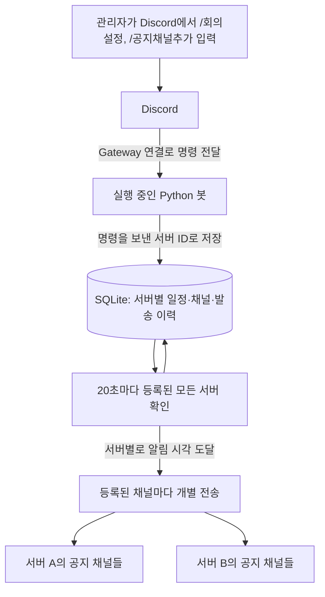

# Temp0.7 회의 알림 봇

매주 정해진 요일·시간의 회의를 Discord 텍스트 채널에 알립니다. 봇 하나(토큰 하나)로 원하는 만큼의 서버에 설치해 운영합니다. 각 서버는 자신의 회의 일정 하나와 공지 채널 목록(1개 이상)을 독립적으로 관리하며, 한 서버에서 실행한 명령이나 한 채널의 전송 실패가 다른 서버·채널에 영향을 주지 않습니다. 수동 `/알림`, 당일 오전 9시, 시작 10분 전 공지에는 모두 `@everyone` 멘션을 포함합니다. 뉴스, 발표자 지정·멘션, 팀장 DM, RAG는 이후 범위입니다.

코드를 이해하고 직접 수정하는 연습은 [프로젝트 학습 가이드](docs/LEARNING_GUIDE.md)를 참고하세요. 현재 구현 흐름, 설계 선택의 이유와 한계, 테스트 해설, 단계별 실습을 담았습니다.

## 처음 접하는 Discord 봇의 구조

- **서버(Guild)**: 동아리 사람들이 모인 Discord 공간입니다. 코드를 실행하는 컴퓨터 서버와는 다른 개념입니다.
- **채널(Channel)**: 서버 안의 `#공지` 같은 대화방입니다.
- **애플리케이션(Application)**: Discord 개발자 포털에 만드는 봇의 등록 정보입니다.
- **봇(Bot)**: 애플리케이션에 연결된 자동화 계정입니다. 개발자 포털에서 등록하고 원하는 서버에 초대합니다.
- **봇 토큰(Token)**: 코드가 봇 계정으로 접속할 때 사용하는 비밀 인증값입니다. 모든 서버에서 같은 토큰을 공유합니다.
- **슬래시 명령어**: Discord 입력창에 `/회의설정`처럼 입력하는 기능입니다.
- **Cog**: 관련 명령과 처리를 묶는 Python 모듈입니다. 하나의 Cog가 봇이 설치된 모든 서버의 요청을 처리하며, 서버 ID로 데이터를 구분합니다.



코드는 내 컴퓨터 또는 상시 실행 서버에서 돌아갑니다. Discord가 이 Python 프로그램을 대신 실행하지는 않습니다. PC가 꺼지거나 잠자기에 들어가면 알림도 멈춥니다.

이 구현은 Discord Gateway에 연결하므로 공개 웹 주소, 포트 개방, ngrok, Interactions Endpoint URL이 필요하지 않습니다. Discord 공식 빠른 시작의 HTTP 방식 예제와 연결 방식이 다릅니다. [Discord 명령 수신 방식](https://docs.discord.com/developers/interactions/receiving-and-responding)

## 필요한 환경변수

`.env.example`을 `.env`로 복사한 뒤 값을 입력합니다. `.env`는 Git에서 제외됩니다. 토큰은 채팅에 붙여 넣지 말고 로컬 파일에 입력하세요.

| 변수 | 필수 여부 | 의미·발급 위치 |
|---|---|---|
| `DISCORD_BOT_TOKEN` | 필수·비밀 | 개발자 포털 → 해당 앱 → Bot → Reset Token |
| `BOT_TIMEZONE` | 선택 | 기본 `Asia/Seoul`. 모든 서버가 공유하는 시간대 |
| `DATABASE_PATH` | 선택 | 기본 `data/meetings.sqlite3`; 서버별 회의 시간·공지 채널·발송 이력 저장 |

서버 ID, 채널 ID는 더 이상 환경변수로 설정하지 않습니다. 봇을 서버에 초대한 뒤, 그 서버 안에서 `/공지채널추가`로 공지 채널을 등록하고 `/회의설정`으로 회의 시간을 등록합니다. 회의 알림에는 OpenAI API Key, Client Secret, Public Key, 외부 DB 비밀번호도 필요하지 않습니다. Application ID도 코드가 로그인 정보에서 확인하므로 환경변수로 입력하지 않습니다.

```dotenv
DISCORD_BOT_TOKEN=발급받은_봇_토큰
BOT_TIMEZONE=Asia/Seoul
DATABASE_PATH=data/meetings.sqlite3
```

같은 봇을 원하는 서버 수만큼 각각 초대하세요. 동아리 서버에서 `/회의설정`이나 `/공지채널추가`를 실행하면 동아리 서버의 데이터만, 테스트 서버에서 실행하면 테스트 서버의 데이터만 변경됩니다. `/알림`, `/회의확인`, `/회의해제`, `/알림테스트`, `/공지채널제거`, `/공지채널목록`도 실행한 서버에만 적용됩니다. 각 서버에서 공지 채널로 쓸 채널에 보기·쓰기·전체 멘션 권한이 필요하며, 봇이 접근할 수 없는 채널을 등록하면 등록은 되지만 발송 시점에 실패로 표시됩니다.

> 이전 버전에서 `DISCORD_GUILD_ID`/`DISCORD_ANNOUNCEMENT_CHANNEL_ID`(및 `DISCORD_TEST_*`)로 운영했다면, 처음 한 번 실행할 때 그 값이 있으면 자동으로 새 채널 목록에 옮겨지고 로그에 안내가 남습니다. 이후에는 `.env`에서 해당 값을 지우고 `/공지채널추가`·`/공지채널제거`로 관리하세요.

## Discord 설정: 순서대로 진행

1. Discord에서 개발용 서버와 `#회의알림-테스트` 텍스트 채널을 만듭니다.
2. [Discord Developer Portal](https://discord.com/developers/applications)에 로그인하고 **New Application**으로 앱을 만듭니다. 이름 예: `Temp0.7 회의봇`.
3. 앱의 **Bot** 페이지에서 **Reset Token**으로 토큰을 만들고 `.env`의 `DISCORD_BOT_TOKEN`에 넣습니다. 유저 계정의 토큰이나 Client Secret을 넣는 것이 아닙니다.
4. **Installation**에서 **Guild Install**을 사용합니다. **Install Link**는 **Discord Provided Link**, **Default Install Settings → Guild Install**의 Scopes는 `bot`, `applications.commands`로 설정합니다.
5. 봇의 Permissions는 **View Channels**, **Send Messages**, **Mention Everyone**을 선택합니다. 전체 멘션 권한의 표기는 `Mention @everyone, @here, and All Roles`일 수도 있습니다. 봇 자체에 Administrator 권한을 줄 필요는 없습니다.
6. 같은 Install Link를 사용해 **운영할 서버마다** 각각 설치합니다(예: 동아리 서버, 테스트 서버). 설치하는 사람에게 각 서버의 서버 관리 권한이 있어야 합니다. 서버를 추가로 운영하고 싶으면 같은 링크로 그 서버에 설치하기만 하면 되고, 코드나 `.env` 변경은 필요 없습니다.
7. 각 서버에서 관리자가 `/공지채널추가`로 알림을 받을 채널을 하나 이상 등록하고, `/회의설정`으로 회의 요일·시간을 등록합니다. `/공지채널목록`으로 등록 상태를 확인할 수 있습니다.
8. 알림 채널의 권한 덮어쓰기가 봇의 보기·쓰기·전체 멘션 권한을 차단하지 않는지 확인합니다. 사용자에게도 슬래시 명령어 사용 권한이 필요합니다.

설치와 토큰 안내: [Discord 공식 시작 가이드](https://docs.discord.com/developers/quick-start/getting-started). ID 복사 안내: [Discord 공식 도움말](https://support.discord.com/hc/en-us/articles/206346498-Where-can-I-find-my-User-Server-Message-ID).

**Privileged Gateway Intents는 모두 꺼 두어도 됩니다.** 지금 기능은 채팅 본문, 회원 전체 목록, 접속 상태를 읽지 않습니다. [discord.py Intents 안내](https://discordpy.readthedocs.io/en/stable/intents.html)

## 로컬 실행

Python 3.11 이상과 Poetry 2 이상이 필요합니다. Poetry가 없다면 [공식 설치 안내](https://python-poetry.org/docs/#installation)를 참고하세요. 프로젝트 폴더에서 다음을 실행합니다.

```sh
poetry install
cp .env.example .env
```

`.env`를 편집한 뒤:

```sh
poetry run python -m meeting_bot --check-config
poetry run python -m meeting_bot
```

`--check-config`는 값의 존재·형식만 검사합니다. 토큰 유효성은 로그인 시, 채널 접근·멘션 권한은 `/공지채널추가` 또는 `/알림테스트` 실행 시 확인합니다. 토큰을 변경하면 프로그램을 재시작하세요. 서버·채널 등록은 재시작 없이 슬래시 명령으로 바로 반영됩니다.

Poetry는 `poetry.lock`에 고정된 의존성을 프로젝트의 `.venv`에 설치합니다. 별도로 가상환경을 활성화하지 않고 `poetry run`으로 실행합니다. 기존 `.env`가 있다면 복사 단계를 건너뛰세요.

테스트·코드 검사 도구도 기본 설치됩니다. 운영 환경에서 실행용 의존성만 설치하려면 다음을 사용합니다.

```sh
poetry install --only main
```

## 명령어와 첫 확인

| 명령어 | 실행 가능 사용자 | 동작 |
|---|---|---|
| `/공지채널추가 채널:#공지` | 서버 관리자 | 이 서버의 회의 알림을 받을 공지 채널을 등록. 여러 채널을 등록할 수 있음 |
| `/공지채널제거 채널:#공지` | 서버 관리자 | 등록된 공지 채널을 목록에서 제거 |
| `/공지채널목록` | 서버 사용자 | 이 서버에 등록된 공지 채널 목록 확인 |
| `/뉴스레터채널추가 채널:#뉴스레터` | 서버 관리자 | 이 서버의 뉴스레터용 채널을 등록(현재는 등록만 지원, 자동 발송 기능은 아직 없음) |
| `/뉴스레터채널제거 채널:#뉴스레터` | 서버 관리자 | 등록된 뉴스레터 채널을 목록에서 제거 |
| `/뉴스레터채널목록` | 서버 사용자 | 이 서버에 등록된 뉴스레터 채널 목록 확인 |
| `/회의설정 요일:수요일 시:20 분:0` | 서버 관리자 | 매주 수요일 20:00 등록. 기존 일정이 있으면 변경 |
| `/회의확인` | 서버 사용자 | 현재 일정·다음 회의·등록된 공지 채널 확인. 결과는 본인에게만 표시 |
| `/회의해제` | 서버 관리자 | 이후 회의 알림 중지 |
| `/알림` | 서버 관리자 | `/회의설정`에 저장된 시간을 가져와 금일 회의 안내를 등록된 모든 공지 채널에 즉시 전송 |
| `/알림테스트` | 서버 관리자 | 등록된 모든 공지 채널에 멘션 없는 테스트 메시지 전송 |

설정·해제·수동 알림·테스트·채널 관리 명령의 '관리자'는 Discord **Administrator** 권한을 가진 사람입니다. 역할 이름이 '관리자'인지만으로 판단하지 않습니다. 모든 명령은 **명령을 입력한 서버**의 일정·채널만 조회하거나 변경하며, 다른 서버의 데이터에는 접근할 수 없습니다.

한 서버 안에서도 **공지 채널과 뉴스레터 채널은 완전히 분리**됩니다. `/공지채널추가`로 등록한 채널에는 회의 관련 알림(당일 09:00, 10분 전, `/알림`, `/알림테스트`)만 전송되고, `/뉴스레터채널추가`로 등록한 채널에는 그중 어떤 것도 전송되지 않습니다. 같은 채널을 두 명령으로 각각 등록하면 두 종류에 모두 속할 수 있지만, 보통은 서로 다른 채널(예: `#공지`, `#뉴스레터`)을 하나씩 지정합니다. 뉴스 큐레이션 기능(PRD FR-1~3) 자체는 아직 구현되어 있지 않으므로, 지금은 뉴스레터 채널을 등록해도 실제로 발송되는 내용은 없습니다 — 이후 뉴스레터 기능을 만들 때 이 채널 목록을 그대로 사용할 수 있도록 미리 분리해 둔 것입니다.

`/알림`은 시간을 입력하지 않고 해당 서버의 `/회의설정`에 저장된 회의 시간을 사용합니다. `#봇명령어` 등에서 입력해도 해당 서버에 등록된 공지 채널들로 전송합니다. 날짜는 봇의 설정 시간대(기본 한국 시간)의 금일 날짜를 사용합니다. 회의 미설정·해제 상태이거나 오늘이 등록된 회의 요일이 아니거나 등록된 공지 채널이 없으면 공지를 보내지 않고 실행자에게 안내합니다. 등록된 채널이 여러 개면 채널마다 개별로 전송을 시도하며, 일부 채널 전송이 실패해도 나머지 채널에는 정상 전송되고 결과에 성공·실패 채널이 함께 표시됩니다. 기존 일정과 자동 알림은 변경하지 않습니다. `@everyone`을 포함해 보내며, 완료 안내는 실행자에게만 표시됩니다. 연속 공지를 줄이기 위해 각 서버에서 30초에 한 번 실행할 수 있습니다.

수동 공지와 당일 오전 9시 자동 알림은 같은 형식을 사용합니다. 아래는 회의 시간이 20:30으로 설정된 경우의 예시입니다.

> @everyone
>
> 📢 **금일 회의 안내**
>
> 안녕하세요, Temp0.7 여러분.<br>
> 금일 회의 일정을 아래와 같이 안내드립니다.
>
> • **일자:** 2026년 09월 09일 (수)<br>
> • **시간:** 20:30 (Asia/Seoul)
>
> 원활한 회의 진행을 위해 시작 시간에 맞추어 참석해 주시면 감사하겠습니다.<br>
> 감사합니다.

10분 전 자동 알림은 `@everyone` 멘션과 함께 **⏰ 회의 시작 안내** 제목으로 전송합니다. 인사말 다음에 "회의 시작까지 약 **10분** 남아 안내드립니다."를 표시하고, 동일한 날짜·시간·참석 안내를 포함합니다. 지연 시 남은 시간을 다시 계산하며, 자정 직전 알림에도 실제 회의 날짜를 표시합니다.

처음에는 `/공지채널추가`로 채널을 등록하고 `/알림테스트`로 연결을 확인한 뒤 `/회의설정` → `/회의확인` 순서로 사용하세요. 실제 10분 전 알림을 시험하려면 개발용 서버에서 현재 시각보다 12분 뒤로 회의를 등록하고 봇을 켜 둡니다. 이 알림은 실제 `@everyone` 멘션을 포함합니다. 테스트 후 `/회의해제`하거나 운영 일정으로 변경하세요.

명령이 보이지 않으면 봇 실행 로그의 명령 등록 성공 여부, `applications.commands` 설치 범위, 사용자의 명령 사용 권한을 확인합니다. 명령은 전역으로 등록되며, 봇이 새로 참여하는 서버에는 그 자리에서 즉시 등록을 시도하고 그 결과도 로그에 남습니다. 전역 등록은 Discord 쪽 전파에 최대 한 시간이 걸릴 수 있지만, 이미 참여 중인 서버에는 봇이 연결될 때마다 서버별로도 즉시 등록을 시도하므로 실제로는 바로 나타나는 경우가 많습니다. 한 서버의 명령 등록이 실패해도 다른 서버 등록은 계속됩니다. 실패한 서버에서 봇 초대 상태와 권한을 확인한 뒤 프로그램을 재시작하세요.

## 일정·실패 처리 정책

- 봇이 설치된 서버마다 매주 하나의 정기 회의와 하나 이상의 공지 채널을 지원하며, 설정·채널 목록·발송 이력은 같은 SQLite 파일에 서버 ID(및 채널 ID)로 구분해 저장됩니다. 재시작 후에도 유지됩니다. 새 서버는 코드 변경 없이 봇을 초대하고 슬래시 명령으로 등록하는 것만으로 추가됩니다.
- 수동 공지·당일 09:00·10분 전 알림에 모두 `@everyone`을 포함합니다. `/알림테스트`는 멘션 없이 보냅니다. 개인 알림 설정에 따라 실제 푸시 수신 여부는 다를 수 있습니다.
- 스케줄러는 20초마다 등록된 모든 서버의 일정을 확인합니다. 서버별로 별도 잠금을 사용하고 동시에 처리하므로, 한 서버의 처리 지연이 다른 서버의 확인·발송을 막지 않습니다. 봇 프로세스 자체가 종료되면 모든 서버가 함께 중단됩니다.
- 발송 이력은 **서버·채널·알림 종류(발송 키) 조합**으로 기록됩니다. 같은 서버에 채널이 여러 개면 채널마다 독립적으로 선점(claim)·전송·기록하므로, 한 채널의 전송 실패나 권한 문제가 같은 서버의 다른 채널 발송에 영향을 주지 않습니다.
- 09:00 이전 또는 정각 회의는 회의 후 안내를 피하기 위해 오전 알림을 생략합니다. 이는 PRD의 모호한 부분에 적용한 기본 정책입니다.
- 20초 간격 확인이므로 정상 동작 시 약 20초 범위의 지연이 있을 수 있습니다. 잠깐 중단되면 예정 시각에서 2분 이내의 알림만 보충하고, 이미 시작한 회의 알림은 보내지 않습니다.
- 새로 등록·변경하기 전에 지난 알림 시각은 소급하지 않습니다. 예: 19:51에 20:00 회의를 등록하면 그날 19:50 알림은 생략합니다.
- 일정 변경·해제와 전송은 같은 서버 잠금으로 처리합니다. 이미 Discord에 전송을 시작한 메시지는 취소되지 않습니다.
- 발송 전에 DB에 `pending`, 성공 시 `sent`를 채널 단위로 기록합니다. 명확한 HTTP 4xx 실패는 해당 채널만 2분 허용 시간 안에서 다시 시도합니다. 네트워크 단절·5xx·전송 중 종료처럼 결과가 불명확하면 자동 재발송하지 않고 기록·로그를 남깁니다. 중복을 줄이는 대신 해당 채널의 해당 알림이 누락될 수 있으며, 완전한 1회 전달을 보장하지 않습니다.
- 채널이 삭제되어 더 이상 조회되지 않으면(404) 다음 확인 시 해당 채널을 등록에서 자동으로 제거하고 로그를 남깁니다. 권한 부족 등 다른 실패는 등록을 유지한 채 로그만 남기므로, 권한을 고쳐 주면 다음 확인부터 다시 시도합니다.
- `/회의확인`은 관리자에게 미확인 발송 기록 수를 표시합니다. 기록이 있으면 로그와 채널 메시지를 대조하세요. 현재 자동 복구 명령은 없습니다.
- 봇은 **한 프로세스만** 실행하세요. `data/`를 보존해야 서버별 설정·채널 목록과 중복 방지 이력이 유지됩니다. 운영 환경에서는 상시 실행 호스트와 영속 디스크가 필요합니다.

## 코드와 검증

| 파일 | 역할 |
|---|---|
| `meeting_bot/__main__.py` | Discord 로그인, 전역·서버별 명령 동기화, 시작·종료 |
| `meeting_bot/config.py` | 환경변수(토큰·시간대·DB 경로) 읽기·검증 |
| `meeting_bot/cog.py` | 명령 권한 검사, 채널 등록 관리, 20초 스케줄러, 서버·채널별 알림 전송 |
| `meeting_bot/messages.py` | 수동·자동 알림의 공통 공지 양식 |
| `meeting_bot/schedule.py` | 다음 회의와 알림 시각 계산 |
| `meeting_bot/storage.py` | 서버별 회의 설정·용도별(공지/뉴스레터) 채널 목록·채널별 발송 이력 영속 저장 |
| `tests/test_meetings.py` | 날짜 경계, 일정 변경, 채널 관리, 중복·실패 처리, 권한 검증 |
| `tests/test_two_servers.py` | 서로 다른 서버의 명령·스케줄러·발송 이력이 독립적으로 동작하는지 검증 |
| `tests/test_startup.py` | 전역·서버별 명령 동기화, 신규 서버 참여 시 즉시 동기화, 종료 시 정리 |

```sh
poetry run pytest
poetry run ruff check .
```

테스트는 실제 Discord 메시지를 보내지 않습니다. 실제 토큰 인증, 서버 설치, 채널 권한과 멘션 전달은 위 개발용 서버 절차로 별도 검증해야 합니다.
