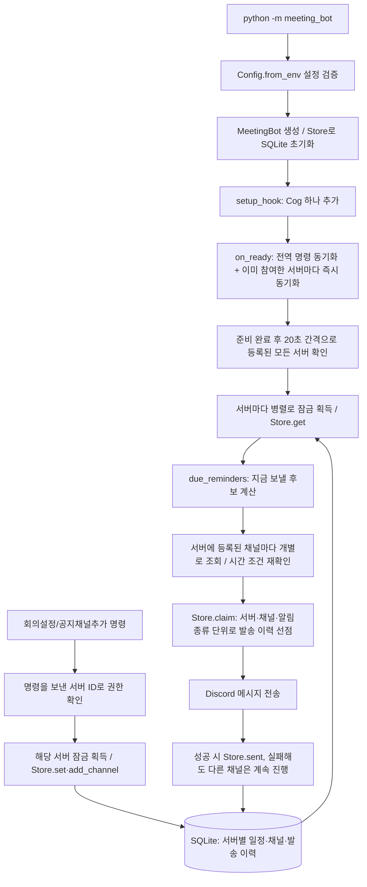
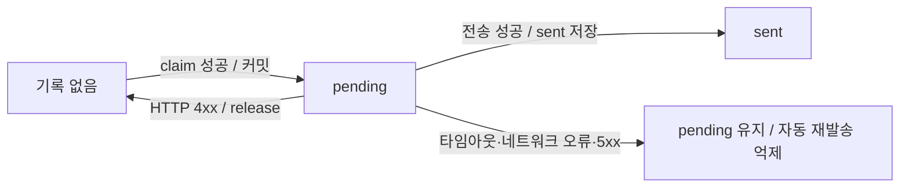

# Discord 회의 봇으로 배우는 코드 이해와 품질 판단

이 문서는 2026-09-09 작업 폴더의 구현을 기준으로 작성했다. 목표는 모든 코드를 외우는 것이 아니라 **실행을 예측하고, 실패 원인을 설명하고, 작은 변경을 검증할 수 있게 되는 것**이다. 아래 설명은 현재 소스에 근거한다. 실제 Discord 연결과 운영 성공까지 확인했다는 뜻은 아니다.

## 1. 먼저 알아둘 현재 범위

| 구분 | 현재 상태 | 확인할 코드 |
|---|---|---|
| 서버마다 여러 공지 채널 등록·해제·목록 | 구현됨. Administrator 권한 필요(목록 확인은 제외) | `add_channel`, `remove_channel`, `list_channels`, `Store` |
| 여러 서버 동시 운영(코드·`.env` 변경 없이 초대만으로 추가) | 구현됨. 서버별 잠금·데이터로 분리 | `MeetingCog`, `Store`, `__main__.on_guild_join` |
| 매주 회의 하나 등록·변경 | 구현됨. Administrator 권한 필요 | `MeetingCog.set_meeting`, `Store.set` |
| 회의 확인·해제 | 구현됨. 확인은 일반 사용자도 가능, 해제는 관리자 | `show_meeting`, `disable_meeting` |
| 당일 오전 9시 알림 | 구현됨. 09:00 이하 회의는 생략 | `due_reminders` |
| 10분 전 전체 멘션 | 구현됨. 남은 분을 올림해서 표시 | `MeetingCog.reminders` |
| 멘션 없는 연결 테스트 | 구현됨. 관리자 명령, 쿨다운 30초 | `test_reminder` |
| 재시작 후 일정·발송 이력 보존 | SQLite 파일을 유지하면 가능 | `Store` |
| 발표자 지정·개별 멘션·팀장 DM | 미구현 | PRD FR-7~9 |
| 뉴스 수집·큐레이션 | 미구현 | PRD FR-1~3 |
| 회의록 수집·RAG 질문 | 미구현 | PRD FR-10~12 |
| 실제 서버 운영 검증 | 이 문서 작성 시 수행하지 않음 | 개발용 서버에서 별도 확인 필요 |

[PRD](PRD.md)는 제품이 최종적으로 할 일이고, [구현 계획](IMPLEMENTATION_PLAN.md)은 제안된 개발 순서다. 계획에 적힌 디렉터리나 기능이 현재 코드에 모두 존재하는 것은 아니다. 현재 기능의 사용·설치 방법은 [README](../README.md)를 참고한다.

## 2. 코드를 읽는 순서

처음부터 긴 `cog.py`를 모두 읽기보다 계산 → 저장 → 외부 연결 순으로 범위를 넓힌다.

| 순서 | 파일 | 읽은 뒤 설명할 수 있어야 하는 것 |
|---|---|---|
| 1 | [schedule.py](../meeting_bot/schedule.py) | 언제 어떤 알림이 후보가 되는가? |
| 2 | [test_meetings.py](../tests/test_meetings.py) | 날짜와 실패 상황을 어떻게 재현하는가? |
| 3 | [storage.py](../meeting_bot/storage.py) | 무엇을 DB에 남겨 재시작에 대비하는가? |
| 4 | [cog.py](../meeting_bot/cog.py) | 명령·계산·저장·전송을 어떻게 연결하는가? |
| 5 | [config.py](../meeting_bot/config.py) | 실행 전에 어떤 잘못된 설정을 거르는가? |
| 6 | [__main__.py](../meeting_bot/__main__.py) | 시작할 때 무엇을 만들고 종료할 때 무엇을 정리하는가? |
| 7 | [test_startup.py](../tests/test_startup.py) | 네트워크 없이 시작·종료의 어느 부분을 검증하는가? |

모르는 문법은 해당 구간에 필요한 만큼 찾아본다. 우선 익힐 개념은 `dataclass`, 시간대가 있는 `datetime`, SQL 기본키, `async/await`, 잠금, 테스트 대역이다.

## 3. 프로그램 전체 흐름



**핵심 구분:** `due_reminders`는 후보를 계산할 뿐 메시지를 보내지 않는다. `claim`은 DB에 발송 시도를 기록할 뿐 실제 전달을 보장하지 않는다. 실제 전송은 `channel.send`에서 일어난다.

### 실행 진입점

`main()`은 설정을 읽고, 일반 실행이면 `MeetingBot(config).run(...)`을 호출한다. `--check-config`인 경우에는 설정 형식 확인 후 끝나므로 봇 생성과 DB 초기화도 하지 않는다.

`setup_hook()`은 모든 서버를 함께 처리하는 `MeetingCog` 하나를 추가한다. Cog가 로드되면 반복 작업을 시작하지만, `before_reminders()`가 봇 준비 완료를 기다린다. `on_ready()`는 연결 로그를 남기고, 처음 호출될 때만 슬래시 명령을 전역으로 동기화한 뒤 이미 참여 중인 서버마다 즉시 동기화를 한 번 더 시도해 바로 노출되게 한다. 이후 새 서버에 초대되면 `on_guild_join()`이 그 서버에만 즉시 동기화한다. 종료할 때는 Cog를 제거해 반복 작업을 취소하고 기다린 뒤 봇 연결과 DB를 닫는다.

**확인 질문:** 반복 작업 시작을 `on_ready()`에 옮기면 연결 준비 이벤트가 다시 발생하는 경우를 어떻게 다뤄야 할까?

### 회의 설정 한 번의 흐름

1. 서버 범위(`guild_only`)와 관리자 권한을 확인한다.
2. `defer(ephemeral=True)`로 처리를 시작했음을 응답한다. 최종 결과도 명령 실행자에게만 보낸다.
3. 명령을 보낸 `interaction.guild_id`로 해당 서버의 잠금을 얻고 `Store.set(guild_id, ...)`으로 저장한다.
4. 그 서버에 등록된 공지 채널 목록(`Store.list_channels`)을 함께 보여준다. 채널 유효성(종류·서버·봇 권한)은 실제 전송 시점에 `_resolve_channel()`이 확인한다.
5. 확인 메시지를 보낸다. 다음 반복 확인은 저장된 새 일정을 읽는다.

여기에는 미래 작업을 예약 시스템에 개별 등록하는 코드가 없다. **20초마다 DB를 읽어 현재 시각에 해당하는 알림을 계산하는 방식**이다. PRD의 “재등록” 요구를 이 방식으로 충족하려는 구현이다.

## 4. 시간 계산: 조건 하나씩 말로 바꾸기

`Schedule`은 요일·시·분·변경 버전·변경 시각을 가진다. 요일은 월요일 0부터 일요일 6까지다. `Reminder`는 종류·회의 시각·알림 예정 시각·버전을 가진다.

`next_meeting()`은 해당 시간대에서 다음 회의 날짜를 계산한다. 회의 시각과 현재가 같아도 다음 주를 반환한다. 반면 `due_reminders()`는 지금 발송 가능한 후보를 찾는다. 두 함수의 목적이 다르다.

알림 후보의 핵심 조건은 다음과 같다.

```python
schedule.updated_at <= due <= local < meeting and local - due <= GRACE
```

| 조건 | 뜻 | 막으려는 문제 |
|---|---|---|
| `updated_at <= due` | 설정한 뒤에 도래하는 알림만 허용 | 새 설정 이전 알림의 소급 발송 |
| `due <= local` | 예정 시간이 되어야 함 | 너무 이른 발송 |
| `local < meeting` | 아직 회의 시작 전이어야 함 | 회의 시작 후 뒤늦은 알림 |
| `local - due <= GRACE` | 예정 시간에서 2분 이내여야 함 | 오래된 알림의 뒤늦은 발송 |

허용 시간은 **2분 정각을 포함**한다. 20초는 반복 확인 간격이며, 네트워크·프로세스 정지까지 포함한 전달 지연의 상한 보장은 아니다.

### 먼저 예측하기

수요일 20:00 회의가 전날부터 등록되어 있고, 시간대는 `Asia/Seoul`이라고 가정한다. 아래는 DB 중복 확인 전의 **후보 계산 결과**다.

| 현재 시각 | 예상 후보를 먼저 써 보기 |
|---|---|
| 수요일 08:59 | |
| 수요일 09:02:00 | |
| 수요일 09:02:01 | |
| 수요일 19:51 | |
| 수요일 20:00 | |
| 수요일 19:51에 처음 20:00 회의를 설정한 직후 | |

<details>
<summary>예측한 뒤 확인할 해설</summary>

순서대로 없음, 오전 알림, 없음, 10분 전 알림, 없음, 없음이다. 마지막은 `updated_at <= due`를 만족하지 않는다. 같은 요일·시각을 다시 설정하면 `Store.set()`이 기존 변경 시각을 유지하므로 “처음 등록”과 다르게 동작할 수 있다.

</details>

### 자정과 겹치는 알림

월요일 00:05 회의의 10분 전은 일요일 23:55다. 그래서 `due_reminders()`는 오늘뿐 아니라 내일의 회의도 검사한다. 기존 `test_midnight_and_week_boundary`가 이를 검증한다.

09:10 회의라면 오전 알림과 10분 전 알림이 모두 09:00이다. 현재 코드는 종류가 다른 두 후보를 만들며, 서로 다른 키이므로 둘 다 발송할 수 있다. 이는 코드에서 도출한 동작이며 기존 테스트에 이 사례는 없다. 두 메시지가 필요한지는 제품 정책으로 결정해야 한다.

## 5. 저장과 중복 방지: 가장 중요한 설계 선택

### DB에 무엇이 남는가?

| 테이블 | 주요 값 | 역할 |
|---|---|---|
| `schedules` | `guild_id` 기본키, 요일·시·분, `revision`, `updated_at`, `enabled` | 서버별 일정 하나와 활성 여부 |
| `channels` | `(guild_id, channel_id)` 복합 기본키, `added_at` | 서버별로 등록된 공지 채널 목록(여러 개 가능) |
| `deliveries` | `(guild_id, channel_id, event_key)` 복합 기본키, `status`, `message_id` | 서버·채널 단위로 동일 발송 시도를 구별하고 결과 기록 |

`revision`은 일정의 변경 버전이다. 활성 일정과 동일한 값으로 설정하면 증가하지 않는다. 다른 일정으로 변경하거나 해제 후 재등록하면 기존 행의 버전을 증가시킨다. `disable()`은 행을 지우지 않고 `enabled=0`으로 바꾼다.

발송 키는 `버전:회의시각:알림종류`이며, 여기에 `guild_id`·`channel_id`를 더해 실제 기본키를 이룬다. `claim()`이 `INSERT OR IGNORE`로 행을 삽입하고, 새 행이 생겼을 때만 그 채널로 전송을 진행한다. 같은 서버에 채널이 여러 개면 채널마다 독립적으로 선점·전송하므로 한 채널의 실패가 다른 채널의 발송을 막지 않는다. 다음 20초 확인에서 같은 후보가 다시 나와도 이미 키가 있으면 건너뛴다.

봇 하나로 원하는 만큼의 서버를 운영할 수 있다. 서버마다 별도 Cog를 두지 않고 하나의 `MeetingCog`와 하나의 `Store`가 모든 서버를 처리하며, 서버별 `asyncio.Lock`과 `guild_id`(및 `channel_id`)로 일정·채널·발송 이력을 구분한다. 새 서버를 추가할 때는 봇을 그 서버에 초대하고 슬래시 명령으로 채널·일정을 등록하기만 하면 되고, 코드나 `.env` 변경은 필요 없다.

### 발송 상태 변화



HTTP 4xx의 재시도도 다음 확인에서 시간 조건을 만족해야 한다. 이는 현재 코드가 채택한 오류 분류이며 모든 외부 API에 그대로 적용할 일반 규칙은 아니다.

전송 전에 기록하면 `claim()` 직후 프로세스가 종료될 때 메시지를 보내지 못해도 기록만 남을 수 있다. 반대로 전송 후에만 기록하면 Discord 전송 성공 직후 프로세스가 종료될 때 재시작 후 중복 발송할 수 있다.

현재 구현은 결과가 불명확하면 자동 재발송을 억제한다. **중복 위험을 줄이는 대신 누락을 허용하는 선택**이다. `pending`은 아직 처리 중이거나 결과를 확정하지 못한 기록이지, “확실히 전송에 실패했다”는 뜻이 아니다. 관리자 `/회의확인`에 표시되는 건수도 채널과 로그를 대조해야 한다. 자동 복구 명령은 없다.

**품질 판단 연습:** “중복 방지를 구현했다”라는 설명을 들으면 키의 범위, 기록 시점, 종료 위치별 결과까지 확인한다. “정확히 한 번 전달”이라고 주장할 근거는 현재 구현에 없다.

## 6. 비동기·잠금·권한을 읽는 방법

### `await`가 있는 위치를 표시한다

외부 응답을 기다리는 동안 다른 작업이 진행될 수 있다. 현재 `self.lock`은 일정 변경·해제와 알림 처리가 겹치는 것을 조율한다. 알림 루프는 채널 조회와 메시지 전송 중에도 잠금을 유지한다.

- 얻는 것: 같은 프로세스 안에서 발송 처리 중 일정이 바뀌는 상황을 줄인다.
- 비용: 채널 조회·전송이 느리면 설정·해제도 잠금을 기다린다.
- 범위: `asyncio.Lock`은 이 프로세스 내부의 잠금이다. 다른 프로세스까지 조율하지 않는다.

채널 조회가 `await`로 지연될 수 있어, 조회 후 현재 시각을 다시 읽고 후보 조건을 재확인한다. 다만 이후 전송 자체가 지연될 수 있으므로 회의 전 도착까지 보장하지는 않는다.

`Store`는 동기 SQLite 호출을 이벤트 루프에서 실행한다. 현재처럼 짧은 저장 작업에는 단순하지만, 큰 쿼리나 DB 잠금 대기가 생기면 다른 비동기 작업도 지연될 수 있다. 기능 규모를 늘릴 때 관찰할 지점이다.

### 권한은 서로 다른 두 질문이다

1. **사용자가 이 명령을 실행해도 되는가?** `has_permissions(administrator=True)`와 `guild_only()` 서버 범위 검사.
2. **봇이 채널에 메시지를 보낼 수 있는가?** `_resolve_channel()`의 채널 종류·서버 일치·봇 권한 검사. 채널 하나가 이 검사를 통과하지 못해도 같은 서버의 다른 채널 전송은 계속 진행된다.

`default_permissions` 설정과 런타임 검사 코드를 구분해서 읽는다. 멘션도 메시지 문자열과 `allowed_mentions`를 함께 본다. 수동 공지·오전 알림·10분 전 알림은 전체 멘션을 허용한다. 개인·역할 멘션은 꺼져 있고 연결 테스트는 멘션하지 않는다.

현재 공통 채널 검사에는 전체 멘션 권한이 항상 포함된다. 따라서 멘션 없는 `/알림테스트`도 그 권한이 없으면 거부된다. 의도한 정책인지 검토할 수 있는 지점이다.

## 7. 테스트가 증명하는 것과 남는 질문

문서 작성 시 프로젝트의 기존 가상환경에서 다음 명령을 실행했고 테스트가 모두 통과했다. 매개변수화된 사례를 포함한 개수이며, 정확한 개수는 실행 결과를 직접 확인한다.

```sh
poetry run python -m pytest -q
```

| 테스트 | 실제로 확인하는 것 |
|---|---|
| `test_reminder_windows` | 알림 전후 시각과 회의 시작 시각의 후보 판단 |
| `test_midnight_and_week_boundary` | 월요일 새벽 회의의 일요일 알림 |
| `test_schedule_change_and_persistence` | 동일 설정·변경·재시작·해제 후 재설정 |
| `test_pending_send_is_not_repeated_after_restart` | 미확인 기록이 재시작 후 재선점을 막음 |
| `test_channel_registration_add_remove_list` | 서버별 채널 등록·중복 방지·제거 |
| `test_send_deduplication_and_mentions` | 같은 시각에 루프를 두 번 호출해도 전송 대역은 한 번 호출 |
| `test_known_failure_retries_but_uncertain_send_does_not` | 403은 재시도, 타임아웃은 재시도 억제 |
| `test_one_channel_failure_does_not_block_another_in_the_same_guild` | 같은 서버의 채널 하나가 실패해도 다른 채널은 발송됨 |
| `test_permissions_enforced_at_runtime` | 설정·해제·채널 관리 명령의 권한 검사 함수가 무권한 사용자를 거부 |
| `test_commands_register_globally_and_scheduler_stops_without_network` | 전역 명령 목록·반복 작업 종료 |
| `test_on_ready_syncs_globally_once_and_per_already_joined_guild` | 최초 연결 시 전역+서버별 동기화, 재연결 시 중복 동기화 방지 |
| `test_two_servers.py`의 테스트들 | 서로 다른 서버의 명령·스케줄러·발송 이력이 독립적으로 동작함 |
| `test_invalid_config` | 지정한 잘못된 환경변수 사례 거부 |

`AsyncMock`은 실제 Discord 전송을 대신하는 비동기 테스트 대역이다. `patch("meeting_bot.cog.datetime")`은 해당 모듈의 시간을 고정한다. `tmp_path`는 운영 DB 대신 임시 DB를 제공한다. 그래서 실제 시간을 기다리거나 서버에 메시지를 보내지 않고도 정책을 확인한다.

**통과만으로 확인되지 않는 것:** 실제 토큰 인증, Discord 명령 노출, 채널 권한 덮어쓰기, 실제 푸시 알림, 운영 호스트 재시작·영속 디스크, 장시간 네트워크 지연이다. 5xx 분기와 채널 조회 후 시간 재확인도 코드에는 있지만 전용 테스트는 현재 없다. 설정의 시간대 선택 기능이 모든 서머타임 전환을 검증했다는 의미도 아니다.

## 8. 직접 손으로 해보는 작은 실습

아래는 **앞으로 할 연습**이다. 문서 작성 과정에서 제품 코드나 테스트를 이 내용대로 변경하지 않았다. 각 실습은 먼저 예상 결과를 적고, 구현 또는 테스트를 작성하고, 실행 결과가 달랐던 이유를 한 줄로 남긴다. 실제 알림이 필요한 실습 외에는 임시 DB와 전송 대역을 사용한다.

### 실습 A — 정확히 2분의 경계 추가

- 읽을 곳: `GRACE`, `test_reminder_windows`.
- 과제: 09:02:00과 19:52:00에는 후보가 있고, 각각 1초 뒤에는 없는 사례를 추가한다.
- 완료 기준: 원래 코드에서 통과하고, 비교를 `< GRACE`로 잠깐 바꾸면 정각 경계 사례가 실패한다. 실험 후 제품 코드는 되돌린다.
- 배우는 것: 구현을 그대로 복사한 테스트가 아니라, 정책의 경계를 잡는 테스트 만들기.

### 실습 B — 왜 테스트가 실패하는지 설명

- 읽을 곳: `Store.set`, `test_schedule_change_and_persistence`.
- 과제: 동일 설정으로 다시 저장한 경우와 해제 후 같은 설정으로 등록한 경우의 `revision`을 종이에 예측한다. 실제 임시 DB 결과와 비교한다.
- 완료 기준: 두 경우에 `self.get()`의 반환값이 왜 다른지 설명한다.
- 배우는 것: 조건 분기와 저장 상태를 함께 추적하기.

### 실습 C — 느린 채널 조회 재현

- 읽을 곳: `reminders`의 두 `datetime.now()` 호출.
- 과제: 첫 시각은 19:51:59, 채널 조회 후 시각은 19:52:01로 설정한다. 회의는 20:00이며 이전부터 등록되어 있다고 가정한다.
- 완료 기준: `channel.send`가 호출되지 않고 발송 기록도 선점되지 않는 테스트를 만든다.
- 힌트: 기존 시간 대역의 고정 `return_value` 대신 순서대로 다른 값을 반환하는 `side_effect`를 검토한다.
- 배우는 것: 기다림 전에는 맞았던 조건이 기다림 후에도 맞는지 확인하기.

### 실습 D — 오전 알림 문구만 수정

- 읽을 곳: `reminders`의 `content` 생성, `test_morning_send_has_no_ping`.
- 과제: 오전 알림에 회의 요일을 추가한다.
- 완료 기준: 새 요일 문구를 검증하고, 오전 메시지의 전체 멘션도 유지한다. 10분 전 알림 테스트도 통과한다.
- 배우는 것: 작은 요구사항을 좁은 범위에서 수정하고 기존 동작 보호하기.

### 실습 E — 09:10 회의의 정책 결정

- 읽을 곳: `due_reminders`의 후보 생성과 `Reminder.key`.
- 과제: 두 알림을 유지할지 하나로 합칠지 먼저 요구사항 한 문장으로 쓴다. 선택한 정책의 테스트를 만들고 필요한 경우 구현한다.
- 완료 기준: 09:00·09:01·09:10·09:11 회의의 차이를 설명하고, 통합한다면 어떤 멘션을 유지할지도 명시한다.
- 배우는 것: 코딩 전에 모호한 제품 동작을 결정하기.

### 실습 F — 전송 실패 정책 보강

- 읽을 곳: `test_known_failure_retries_but_uncertain_send_does_not`.
- 과제: HTTP 500 전송 대역으로 두 번 확인했을 때 전송 시도 한 번, `pending` 한 건임을 검증한다.
- 완료 기준: “서버 오류니까 무조건 재시도”가 현재 정책과 왜 다른지 설명한다.
- 배우는 것: 실패 응답과 실제 미전달이 항상 같은 의미는 아니라는 점 이해하기.

## 9. AI를 학습 도구로 쓰는 방법

처음에는 정답 코드보다 검증 질문을 요청한다. 예를 들어 다음처럼 사용할 수 있다.

> `due_reminders`를 내가 설명할 테니 잘못 이해한 부분만 짚어 줘. 아직 수정 코드는 주지 말고, 반례 하나를 질문해 줘.

> 이 테스트가 어떤 버그를 잡는지 검토해 줘. 통과해도 놓칠 수 있는 상황을 하나 제시하고, 현재 코드의 근거를 알려 줘.

> 오전 알림에 요일을 추가했어. 요구사항 충족 여부와 기존 멘션 정책이 유지되는지 내 변경을 리뷰해 줘.

설명을 받은 뒤에는 AI 답변을 닫고 자신의 말로 다시 설명하거나 작은 수정을 해본다. 막힌 곳은 다시 참고해도 된다. 핵심은 도움을 금지하는 것이 아니라 이해의 빈틈을 확인하는 것이다.

### 학습 기록 양식

실습마다 아래를 복사해 짧게 기록한다.

```text
오늘 읽은 함수:
변경 또는 확인하려는 요구사항:
실행 전 예상:
실제 결과와 증거(테스트 이름 등):
예상과 달랐던 이유:
AI나 문서의 도움이 필요했던 부분:
이제 혼자 설명하거나 수정할 수 있는 부분:
다음에 확인할 질문:
```

## 10. 성장 여부를 확인하는 기준

| 단계 | 스스로 확인할 행동 |
|---|---|
| 읽기 | 회의설정부터 DB 저장까지 함수 흐름을 설명한다 |
| 예측 | 2분 경계·자정·늦은 설정의 결과를 실행 전에 맞힌다 |
| 수정 | 작은 문구나 조건을 바꾸고 필요한 테스트를 고른다 |
| 검증 | 기존 테스트가 놓친 실패 사례를 하나 추가한다 |
| 판단 | 중복 억제와 누락 허용의 이유·한계를 설명한다 |

취업 준비에서 이 프로젝트를 설명할 때도 실제로 이해하고 검증한 범위만 말한다. 예를 들어 “20초마다 일정을 계산하고 SQLite 키로 반복 발송을 억제했다. 발송 결과가 불명확하면 재시도를 막아 누락 가능성이 남는다”라고 설명한 뒤, 해당 코드와 테스트를 보여줄 수 있으면 된다. 미구현 RAG나 확인하지 않은 운영 성과까지 프로젝트 성과로 포함하지 않는다.

첫 학습은 `schedule.py`와 실습 A만으로 시작해도 충분하다. 그다음 저장 상태와 실습 B, 마지막으로 비동기 전송과 실습 C·F로 범위를 넓힌다.
