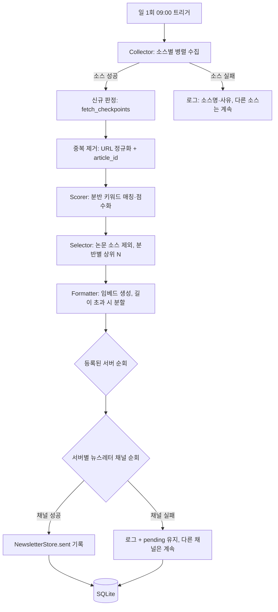

# 뉴스레터 자동 발송 기능 설계 문서

- 기준 문서: [PRD.md](./PRD.md) FR-1~FR-3(뉴스 큐레이션 모듈), [IMPLEMENTATION_PLAN.md](./IMPLEMENTATION_PLAN.md) 단계 3
- 작성일: 2026-09-09
- 작성 시점 기준 상태: 뉴스레터 채널을 서버별로 등록·조회·삭제하는 인프라(`/뉴스레터채널추가`·`/뉴스레터채널제거`·`/뉴스레터채널목록`, `Store`의 `channels` 테이블 `purpose='newsletter'`)만 구현되어 있다. 소스 수집·큐레이션·실제 발송 로직은 아직 없다.
- 이 문서는 구현을 위한 제안이며, PRD의 확정 요구사항과 구분한다. "확정 필요" 항목은 구현 착수 전 운영자가 결정해야 한다.

## 1. 범위

| 포함 | 제외 |
|---|---|
| FR-1 소스 수집, FR-2 관련도 큐레이션, FR-3 채널 전송 | 발표자 관리(FR-7~9), 회의록 RAG(FR-10~12) — 각각 별도 설계 필요 |
| 서버별로 등록된 뉴스레터 채널에 큐레이션 결과 발송 | 사용자별 개인화(개인 DM 발송 등) — PRD에 없음 |
| 재시작 후에도 당일 중복 발송하지 않는 멱등성 | 과거 발송 이력의 정오표·재발행 기능 |

기존 회의 알림 기능(`meeting_bot/cog.py`, `storage.py`)과 같은 SQLite 파일·같은 봇 프로세스를 공유하되, 회의 일정과는 독립된 파이프라인으로 동작한다. 회의 알림 코드를 수정하지 않는 것을 전제로 한다.

## 2. 확정이 필요한 정책

| 항목 | 모호함·미정 | 제안 기본값 |
|---|---|---|
| 소스 목록 | 실제 사용할 RSS/API URL 목록이 없음 | 운영자가 확정한 목록을 `sources` 테이블에 등록. 초기 구현·테스트는 1~2개 공개 RSS로 검증 |
| 분반 키워드 | 웹/앱·데이터AI·피지컬AI 키워드 사전이 없음 | 운영자가 분반별 키워드·가중치 목록을 확정. 코드는 목록을 입력으로만 받고 튜닝은 운영자가 함 |
| 서버별 구독 범위 | 모든 뉴스레터 채널이 3분반을 다 받는지, 서버·채널별로 선택하는지 불명확 | 초기엔 등록된 뉴스레터 채널마다 3분반 전체를 한 메시지(또는 분반별 여러 메시지)로 발송. 서버별 분반 선택은 이후 범위 |
| 발송 시각 | PRD Flow는 09:00, IMPLEMENTATION_PLAN 초안은 08:30 수집 시작·08:55 마감·09:00 발송 | 이 문서에서 08:55 마감·09:00 발송으로 확정. 시간대는 회의 알림과 동일하게 `Config.timezone`(기본 Asia/Seoul) 사용 |
| 논문 소스 제외 | "논문 소스"의 판별 기준이 없음 | `sources.kind = 'paper'`로 소스 단위에서 표시하고, 큐레이션 단계에서 해당 소스 전체를 제외 |
| 분반별 선별 개수 N | 전체 기준인지 분반별 기준인지 불명확 | 분반별 N, 초기 N=3. 같은 기사가 여러 분반에 해당하면 한 번만 표시하고 태그를 모두 붙임 |
| 일부 소스 실패 시 발송 여부 | 전체 실패와 일부 실패를 구분해야 함 | 하나 이상의 소스가 성공하면 그 결과만으로 발송. 전체 실패 시 발송을 생략하고 관리자 확인 경로(`/회의확인`과 유사한 명령)에 실패를 표시 |

## 3. 아키텍처 개요



**핵심 격리 원칙(회의 알림과 동일):** 소스 하나의 수집 실패가 다른 소스 수집을 막지 않고, 채널 하나의 전송 실패가 같은 서버의 다른 채널이나 다른 서버의 발송을 막지 않는다. `MeetingCog._process_guild_reminders`가 서버 단위로 `asyncio.gather`를 쓰는 것과 같은 방식을 재사용한다.

## 4. 데이터 모델(제안)

기존 `Store`(SQLite, `data/meetings.sqlite3`)에 테이블을 추가한다. 별도 DB 파일을 만들 필요는 없다.

```sql
CREATE TABLE sources (
    source_id TEXT PRIMARY KEY,      -- 사람이 읽을 수 있는 식별자, 예: "hn-frontend"
    name TEXT NOT NULL,
    url TEXT NOT NULL,
    kind TEXT NOT NULL,              -- 'rss' | 'api' | 'paper'
    enabled INTEGER NOT NULL DEFAULT 1
);

CREATE TABLE fetch_checkpoints (
    source_id TEXT PRIMARY KEY REFERENCES sources(source_id),
    last_seen_at TEXT,               -- 마지막으로 처리한 게시 시각(ISO 8601)
    last_seen_id TEXT                -- API 소스처럼 시각이 불안정한 경우의 보조 식별자
);

CREATE TABLE articles (
    article_id TEXT PRIMARY KEY,     -- sha256(정규화된 URL)
    source_id TEXT NOT NULL REFERENCES sources(source_id),
    title TEXT NOT NULL,
    url TEXT NOT NULL,
    published_at TEXT,
    fetched_at TEXT NOT NULL
);

CREATE TABLE article_divisions (
    article_id TEXT NOT NULL REFERENCES articles(article_id),
    division TEXT NOT NULL,          -- 'web_app' | 'data_ai' | 'physical_ai'
    score REAL NOT NULL,
    PRIMARY KEY (article_id, division)
);

CREATE TABLE newsletter_deliveries (
    guild_id INTEGER NOT NULL,
    channel_id INTEGER NOT NULL,
    delivery_date TEXT NOT NULL,     -- 'YYYY-MM-DD', 봇 시간대 기준
    status TEXT NOT NULL,            -- 'pending' | 'sent'
    message_ids TEXT,                -- JSON 배열(분할 전송 대비)
    PRIMARY KEY (guild_id, channel_id, delivery_date)
);
```

`newsletter_deliveries`는 회의 알림의 `deliveries` 테이블과 같은 역할이다. 발송 키가 `(revision, meeting_at, kind)`가 아니라 `delivery_date`인 점만 다르다. 채널별로 독립된 행이므로 한 채널의 실패가 다른 채널 기록에 영향을 주지 않는다는 요구사항을 그대로 만족한다.

## 5. 처리 파이프라인

1. **수집(FR-1)** — `sources` 중 `enabled=1`인 항목을 병렬로 조회한다. 소스마다 제한 시간·재시도 횟수를 두고, 실패하면 소스명·사유를 로그로 남기고 나머지 소스는 계속 진행한다.
2. **신규 판정** — `fetch_checkpoints.last_seen_at` 이후 게시된 항목만 후보로 남긴다. 첫 실행은 최근 N일 또는 최근 M건으로 범위를 제한한다(전체 백필 금지).
3. **중복 제거** — URL을 정규화(스킴·트래킹 쿼리 파라미터 제거, 소문자화)한 뒤 해시로 `article_id`를 만든다. 이미 `articles`에 있는 `article_id`는 건너뛴다.
4. **스코어링(FR-2)** — 분반별 키워드 사전과 제목·요약을 매칭해 점수를 계산한다. `kind='paper'` 소스는 이 단계 이전에 전량 제외한다.
5. **선별** — 분반별로 점수 상위 N개를 고른다. 여러 분반에 걸치는 기사는 한 번만 표시하고 해당 분반 태그를 모두 붙인다.
6. **포맷팅(FR-3)** — 분반·제목·출처·링크가 포함된 임베드를 만든다. Discord 메시지·임베드 크기 제한을 넘으면 여러 메시지로 분할한다.
7. **발송** — 스케줄 발송 대상 서버를 순회하고, 서버마다 등록된 뉴스레터 채널(`Store.list_channels(guild_id, PURPOSE_NEWSLETTER)`)을 순회하며 채널 단위로 전송을 시도한다. 채널별로 `claim`→전송→`sent`/실패 기록을 독립적으로 수행한다.
8. **기록** — 회의 알림과 같은 재시도 정책을 따른다. HTTP 4xx는 당일 안에서 재시도 가능하도록 `pending`을 지우고, 5xx·타임아웃처럼 결과가 불명확하면 `pending`을 유지하고 자동 재발송하지 않는다.

## 6. 스케줄링

- 회의 알림의 20초 폴링 루프(`MeetingCog.reminders`)와는 별도의 `tasks.loop`를 새로 만든다. 하루에 한 번만 실행하면 되므로 `discord.ext.tasks.loop(time=...)`로 봇 시간대 기준 08:55(수집 마감)·09:00(발송) 두 시점을 각각 등록하거나, 20초 루프처럼 짧은 주기로 깨어나 "오늘 발송했는가"만 확인하는 방식 중 하나를 택한다. 후자가 기존 코드 스타일과 더 일치한다.
- 재시작 시 중복 발송 방지는 `newsletter_deliveries`의 `(guild_id, channel_id, delivery_date)` 기본키로 처리한다. 같은 날 두 번 트리거되어도 이미 `sent`인 채널은 건너뛴다.
- 시간대는 회의 알림과 동일하게 `Config.timezone`을 그대로 사용한다. 서버별로 다른 시간대가 필요하다는 요구사항은 없다.

## 7. Discord 명령(제안)

| 명령 | 상태 | 설명 |
|---|---|---|
| `/뉴스레터채널추가`·`제거`·`목록` | 구현됨 | 발송 대상 채널 등록·조회. 이 문서가 다루는 기능은 이 채널 목록을 소비만 한다 |
| `/뉴스레터발송` | 신규, P1 | 관리자가 오늘자(또는 최근) 큐레이션 결과를 즉시 수동 발송. `/알림`과 동일한 구조(서버 내 등록된 채널 전체 순회, 채널별 성공·실패 표시) |
| `/뉴스레터소스추가`·`제거`·`목록` | 신규, 선택 | 소스를 명령으로 관리. 초기 단계에서는 운영자가 DB에 직접 등록해도 되므로 후속 범위로 미룰 수 있음 |
| `/뉴스레터분반설정` | 신규, 선택 | 서버별 구독 분반 선택. "3. 확정이 필요한 정책"에서 서버별 구독 범위가 필요하다고 결정될 때만 추가 |

## 8. 실패 격리와 관측

- **소스 단위:** 수집 실패는 로그에 소스명·사유를 남기고 다른 소스 수집·이후 단계를 막지 않는다(FR-1 수용 기준).
- **채널 단위:** 회의 알림과 동일하게 채널마다 독립적으로 `claim`·전송·기록한다. 한 채널의 권한 문제나 HTTP 실패가 같은 서버의 다른 채널, 다른 서버의 발송에 영향을 주지 않는다.
- **서버 단위:** 서버별로 `asyncio.gather`를 사용해 한 서버의 느린 처리가 다른 서버의 발송 시각을 밀리지 않게 한다.
- **관측:** 관리자용 확인 명령(`/뉴스레터발송현황` 또는 기존 `/회의확인`처럼 관리자에게만 보이는 요약)에 최근 발송 성공·실패 채널 수를 노출한다. 자동 복구 명령은 두지 않는다(회의 알림과 동일한 선택).

## 9. 의존성

- HTTP 요청: `discord.py`가 이미 `aiohttp`를 의존성으로 포함하므로 추가 패키지 없이 재사용 가능하다.
- RSS 파싱: 표준 라이브러리 `xml.etree.ElementTree`로 직접 파싱할지, `feedparser` 같은 라이브러리를 추가할지는 실제 소스 목록이 정해진 뒤 결정한다. 소스가 표준 RSS/Atom이면 라이브러리 추가가 유지보수에 유리하다.
- 새 의존성을 추가하면 `pyproject.toml`과 `poetry.lock`을 갱신한다.

## 10. 구현 순서(제안)

1. **데이터 모델 + 수집만** — 위 테이블 추가, 소스 1~2개로 수집·중복 제거만 구현하고 발송 없이 로그로 검증한다.
2. **큐레이션** — 분반 키워드 스코어링, 논문 제외, 분반별 상위 N 선별.
3. **포맷팅 + 발송 + 수동 명령** — 임베드 생성, 채널별 격리 발송, `/뉴스레터발송` 수동 명령.
4. **스케줄러 연결** — 일 1회 자동 트리거, 재시작 멱등성 확인.
5. **실 서버 검증** — 테스트 서버에서 압축한 주기(예: 시간마다)로 전체 흐름을 확인한 뒤 운영 주기로 전환.

각 단계 완료 기준은 [IMPLEMENTATION_PLAN.md](./IMPLEMENTATION_PLAN.md)의 "공통 검증 원칙"(시간 주입 테스트, 부분 실패 재현, 범위 밖 채널 미노출 등)을 따른다.

## 11. 테스트 전략

| 대상 | 검증 내용 |
|---|---|
| 수집 | 소스 하나 실패 시 나머지 소스 결과는 그대로 유지되는지 |
| 중복 제거 | 트래킹 파라미터만 다른 동일 기사, 재수집 시 중복 생성되지 않는지 |
| 스코어링 | 분반 키워드 매칭·동점 정렬, 논문 소스 사전 제외 |
| 발송 격리 | 서버 내 여러 뉴스레터 채널 중 하나가 실패해도 나머지는 정상 발송(기존 `test_two_servers.py`의 다중 채널 격리 테스트와 동일한 패턴) |
| 스케줄러 멱등성 | 같은 날 두 번 트리거해도 채널당 한 번만 발송되는지 |
| 회의 알림 회귀 | 뉴스레터 코드 추가가 `PURPOSE_ANNOUNCEMENT` 채널·회의 스케줄러에 영향을 주지 않는지 |

## 12. 운영자가 확정해야 할 항목

- 실제 사용할 뉴스 소스 목록(RSS/API URL)과 논문 소스 여부
- 분반별(웹/앱·데이터AI·피지컬AI) 키워드·가중치 초안
- 서버별로 다른 분반 구독이 필요한지, 아니면 등록된 뉴스레터 채널은 항상 3분반 전체를 받는지
- 발송 시각을 09:00으로 고정할지, 서버별로 다르게 둘지
- 소스 추가·삭제를 슬래시 명령으로 지원할지, 운영자가 DB를 직접 다룰지
